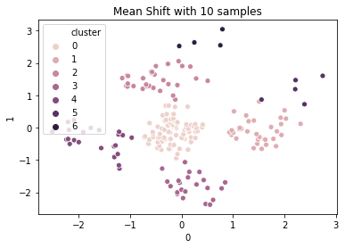

# Python을 이용한 클러스터링 \(3\)

## Load Dataset <a id="Load-Dataset"></a>

### **Import packages**

```python
# data
import pandas as pd
import numpy as np
import warnings
warnings.filterwarnings("ignore") 

# visualization
import matplotlib.pyplot as plt
import seaborn as sns
%matplotlib inline

# preprocessing
from sklearn.preprocessing import StandardScaler
from sklearn.preprocessing import MinMaxScaler
from sklearn.decomposition import PCA
from sklearn.model_selection import train_test_split

# model
from sklearn.cluster import KMeans
from sklearn.cluster import DBSCAN
from scipy.cluster.hierarchy import dendrogram, ward
from sklearn.cluster import AgglomerativeClustering
from sklearn.cluster import AffinityPropagation
from sklearn.cluster import MeanShift, estimate_bandwidth

# grid search
from sklearn.model_selection import GridSearchCV

# evaluation
from sklearn.metrics.cluster import silhouette_score
from sklearn.model_selection import cross_val_score
from sklearn import metrics
from sklearn.metrics import *
```

### **Load mall customers data**

```python
df = pd.read_csv('Mall_Customers.csv')
df.head()
```

|  | CustomerID | Gender | Age | Annual Income \(k$\) | Spending Score \(1-100\) |
| :--- | :--- | :--- | :--- | :--- | :--- |
| 0 | 1 | Male | 19 | 15 | 39 |
| 1 | 2 | Male | 21 | 15 | 81 |
| 2 | 3 | Female | 20 | 16 | 6 |
| 3 | 4 | Female | 23 | 16 | 77 |
| 4 | 5 | Female | 31 | 17 | 40 |

```python
del df["CustomerID"]
```

* ID 값은 clustering을 하는데 있어 필요하지 않아 보이므로 제거하기로 하였다.

```python
df['Gender'].unique()
```

```text
array(['Male', 'Female'], dtype=object)
```

```python
df['Gender'].replace({'Male':1, 'Female':0},inplace=True)
```

* 문자형 데이터를 encoding 하였다.

```text
df.head()
```

|  | Gender | Age | Annual Income \(k$\) | Spending Score \(1-100\) |
| :--- | :--- | :--- | :--- | :--- |
| 0 | 1 | 19 | 15 | 39 |
| 1 | 1 | 21 | 15 | 81 |
| 2 | 0 | 20 | 16 | 6 |
| 3 | 0 | 23 | 16 | 77 |
| 4 | 0 | 31 | 17 | 40 |

```text
df.shape
```

```text
(200, 4)
```

## EDA

### **Describe¶**

```text
df.info()
```

```text
<class 'pandas.core.frame.DataFrame'>
RangeIndex: 200 entries, 0 to 199
Data columns (total 4 columns):
Gender                    200 non-null int64
Age                       200 non-null int64
Annual Income (k$)        200 non-null int64
Spending Score (1-100)    200 non-null int64
dtypes: int64(4)
memory usage: 6.4 KB
```

```text
df.isnull().sum()
```

```text
Gender                    0
Age                       0
Annual Income (k$)        0
Spending Score (1-100)    0
dtype: int64
```

* null 값이 존재하지 않는다 !

```text
df.describe()
```

|  | Gender | Age | Annual Income \(k$\) | Spending Score \(1-100\) |
| :--- | :--- | :--- | :--- | :--- |
| count | 200.000000 | 200.000000 | 200.000000 | 200.000000 |
| mean | 0.440000 | 38.850000 | 60.560000 | 50.200000 |
| std | 0.497633 | 13.969007 | 26.264721 | 25.823522 |
| min | 0.000000 | 18.000000 | 15.000000 | 1.000000 |
| 25% | 0.000000 | 28.750000 | 41.500000 | 34.750000 |
| 50% | 0.000000 | 36.000000 | 61.500000 | 50.000000 |
| 75% | 1.000000 | 49.000000 | 78.000000 | 73.000000 |
| max | 1.000000 | 70.000000 | 137.000000 | 99.000000 |

### **Visualization¶**

```python
sns.countplot('Gender' , data = df)
plt.show()
```


* Female인 경우가 더 많은 것을 알 수 있다.

```python
sns.pairplot(df, hue="Gender")
plt.show()

```


```python
g = sns.heatmap(df.corr(), annot=True, linewidths=.5)
bottom, top = g.get_ylim() # heatmap plot이 잘리는 것 방지하기 위한 방법
g.set_ylim(bottom+0.5, top-0.5)
plt.show()
```


* 변수 간 선형상관관계가 거의 없어 보인다.

## Modeling <a id="Modeling"></a>

### **PCA**

```python
pca = PCA(n_components=2)
reduced_df = pca.fit_transform(df)
reduced_df.shape
```

* 평면에 시각화를 위해 PCA를 이용해 2차원으로 차원 축소를 진행하였다.
* 평가는 시각화 및 Silhouette Coefficient, Davies bouldin score로 진행하였다.
* _**Silhouette Coefficient**_는 실루엣 계수로 -1 부터 1사이의 값을 가지며 1에 가까울 수록 최적화된 군집이라고 할 수 있다.
* _**Davies Bouldin Index**_는 Group 내에서의 Distribution과 비교하여 다른 Group간의 분리 정도의 비율로 계산되는 값으로 모든 두 개의 Group 쌍에 대해 각 Group의 크기의 합을 각 Group의 중심 간 거리로 나눈 값으로서 표현되는 함수이다. 즉, 값이 작을수록 최적화된 군집이라고 할 수 있다.

### 1. K-Means

```python
distortions = []
for k in range(2, 20):
    kmeans = KMeans(n_clusters=k)
    kmeans.fit(reduced_df)
    distortions.append(kmeans.inertia_)

fig = plt.figure(figsize=(10, 5))
plt.plot(range(2, 20), distortions)
plt.grid(True)
plt.title('Elbow curve')
plt.show()
```


* K-Means의 k를 설정하기 위해 Elbow curve를 그려보았다.
* k=5 일때 급격한 distortions의 변화가 일어난 것으로 보아 cluster 수를 5로 설정하기로 하였다.

```python
reduced_df = pd.DataFrame(reduced_df)

km = KMeans(n_clusters=5, init='k-means++')
cluster = km.fit(reduced_df)
cluster_id = pd.DataFrame(cluster.labels_)

d1 = pd.concat([reduced_df, cluster_id], axis=1)
d1.columns = [0, 1, "cluster"]

sns.scatterplot(d1[0], d1[1], hue = d1['cluster'], legend="full")
sns.scatterplot(km.cluster_centers_[:, 0], km.cluster_centers_[:, 1], label = 'Centroids')
plt.title("KMeans Clustering")
plt.legend()
plt.show()

print('Silhouette Coefficient: {:.4f}'.format(metrics.silhouette_score(d1.iloc[:,:-1], d1['cluster'])))
print('Davies Bouldin Index: {:.4f}'.format(metrics.davies_bouldin_score(d1.iloc[:,:-1], d1['cluster'])))
```


```text
Silhouette Coefficient: 0.5526
Davies Bouldin Index: 0.5843
```

### 2. DBScan

```python
eps = [2,5,7,8,10]
for i in eps:
    db = DBSCAN(eps=i, min_samples=4)
    cluster = db.fit(reduced_df)
    cluster_id = pd.DataFrame(cluster.labels_)
    
    d2 = pd.DataFrame()
    d2 = pd.concat([reduced_df,cluster_id],axis=1)
    d2.columns = [0, 1, "cluster"]
    
    sns.scatterplot(d2[0], d2[1], hue = d2['cluster'], legend="full")
    plt.title('DBScan with eps {}'.format(i))
    plt.show()
    
    print('Silhouette Coefficient: {:.4f}'.format(metrics.silhouette_score(d2.iloc[:,:-1], d2['cluster'])))
    print('Davies Bouldin Index: {:.4f}'.format(metrics.davies_bouldin_score(d2.iloc[:,:-1], d2['cluster'])))

```


```text
Silhouette Coefficient: -0.3259
Davies Bouldin Index: 9.0856
```


```text
Silhouette Coefficient: 0.0896
Davies Bouldin Index: 2.1779
```


```text
Silhouette Coefficient: 0.3060
Davies Bouldin Index: 2.1851
```


```text
Silhouette Coefficient: 0.3944
Davies Bouldin Index: 2.0000
```


```text
Silhouette Coefficient: 0.3124
Davies Bouldin Index: 1.9782
```

```python
ss = StandardScaler()
scaled_df = pd.DataFrame(ss.fit_transform(reduced_df))

eps = [0.1, 0.2, 0.3, 0.4, 0.5]
for i in eps:
    db = DBSCAN(eps=i, min_samples=4)
    cluster = db.fit(scaled_df)
    cluster_id = pd.DataFrame(cluster.labels_)
    
    d3 = pd.DataFrame()
    d3 = pd.concat([scaled_df,cluster_id],axis=1)
    d3.columns = [0, 1, "cluster"]
    
    sns.scatterplot(d3[0], d3[1], hue = d3['cluster'], legend="full")
    plt.title('DBScan with eps {}'.format(i))
    plt.show()
    
    print('Silhouette Coefficient: {:.4f}'.format(metrics.silhouette_score(d3.iloc[:,:-1], d3['cluster'])))
    print('Davies Bouldin Index: {:.4f}'.format(metrics.davies_bouldin_score(d3.iloc[:,:-1], d3['cluster'])))
```


```text
Silhouette Coefficient: -0.3248
Davies Bouldin Index: 6.5649
```


```text
Silhouette Coefficient: 0.0994
Davies Bouldin Index: 2.2154
```


```text
Silhouette Coefficient: 0.3939
Davies Bouldin Index: 2.0034
```


```text
Silhouette Coefficient: 0.3298
Davies Bouldin Index: 1.0988
```


```text
Silhouette Coefficient: 0.3451
Davies Bouldin Index: 0.8144
```

* standard scaler로 스케일링을 진행한 데이터에 대해서 DBScan으로 군집을 확인해보았다.
* eps가 변화하면서 생성되는 군집의 변화를 알 수 있다.
* Scaled data와 Not Scaled data 모두 Silhouette Coefficient가 0.5를 넘지 않아 좋은 결과를 보이고 있지는 않은 것 같다.
* Not Scaled Data는 ep가 8일 때, Scaled Data는 ep가 0.3일 때가 가장 적절해 보인다.

### 3. Hierarchical agglomerative clustering

```python
linkage_array = ward(reduced_df)
dendrogram(linkage_array)
plt.xlabel("Sample Num")
plt.ylabel("Cluster Dist")

# 클러스터를 구분하는 커트라인을 표시
ax = plt.gca()
bounds = ax.get_xbound()
ax.plot(bounds, [350, 350], '--', c='k')
ax.plot(bounds, [200, 200], '--', c='k')
ax.text(bounds[1], 350, ' 3 Clusters ', va='center', fontdict={'size': 10})
ax.text(bounds[1], 200, ' 5 Clusters ', va='center', fontdict={'size': 10})
plt.show()
```


* 5개의 cluster보다 많아질 경우 Cluster간 거리가 급격히 줄어드는 것으로 보아 5개의 Cluster로 자르는 것이 적절해 보인다.

### 4. Agglomerative Clustering

```python
n = [2,3,5,7,9]
for i in n:
    agg = AgglomerativeClustering(n_clusters=i)
    cluster = agg.fit(scaled_df)
    cluster_id = pd.DataFrame(cluster.labels_)
    
    d4 = pd.DataFrame()
    d4 = pd.concat([scaled_df,cluster_id],axis=1)
    d4.columns = [0, 1, "cluster"]
    
    sns.scatterplot(d4[0], d4[1], hue = d4['cluster'], legend="full")
    plt.title('Agglomerative with {} clusters'.format(i))
    plt.show()
    
    print('Silhouette Coefficient: {:.4f}'.format(metrics.silhouette_score(d4.iloc[:,:-1], d4['cluster'])))
    print('Davies Bouldin Index: {:.4f}'.format(metrics.davies_bouldin_score(d4.iloc[:,:-1], d4['cluster'])))

```


```text
Silhouette Coefficient: 0.3794
Davies Bouldin Index: 0.8542
```


```text
Silhouette Coefficient: 0.4493
Davies Bouldin Index: 0.7163
```


```text
Silhouette Coefficient: 0.5473
Davies Bouldin Index: 0.5902
```


```text
Silhouette Coefficient: 0.4436
Davies Bouldin Index: 0.7269
```


```text
Silhouette Coefficient: 0.4532
Davies Bouldin Index: 0.6974
```

* Silhouette Coefficient 계수가 가장 큰 것은 5개의 클러스터로 나눈 경우이다.
* Davies Bouldin Index가 가장 작은 것 또한 5개의 클러스터로 나눈 경우이다.
* 따라서 5개의 클러스터로 나눈 경우가 가장 적절해 보인다.

### 5. Affinity Propagation

* 모든 데이터가 특정한 기준에 따라 자신을 대표할 대표 데이터를 선택한다.
* 만약 스스로가 자기 자신을 대표하게 되면 클러스터의 중심이 된다. 참고 :



```python
ap = AffinityPropagation()
cluster = ap.fit(scaled_df)
cluster_id = pd.DataFrame(cluster.labels_)

d5 = pd.DataFrame()
d5 = pd.concat([scaled_df,cluster_id],axis=1)
d5.columns = [0, 1, "cluster"]

sns.scatterplot(d5[0], d5[1], hue = d5['cluster'], legend="full")
plt.title('Affinity Propagation {} clusters'.format(len(d5.cluster.unique())))
plt.show()

print('Silhouette Coefficient: {:.4f}'.format(metrics.silhouette_score(d5.iloc[:,:-1], d5['cluster'])))
print('Davies Bouldin Index: {:.4f}'.format(metrics.davies_bouldin_score(d5.iloc[:,:-1], d5['cluster'])))
```


```text
Silhouette Coefficient: 0.4319
Davies Bouldin Index: 0.7753
```

### 6. Mean Shift

* 각 점들에 대해 데이터의 분포에서 mode를 찾아 이동하다보면 점들이 적당하게 모일 것이라는 것이라는 아이디어
* bandwidth : 얼마나 관대하게 봐줄지를 설정하는 폭 참고 :



```python
n = [10, 50, 100]    
for i in n:
    bandwidth = estimate_bandwidth(scaled_df, quantile=0.2, n_samples=i)
    ms = MeanShift(bandwidth=bandwidth)
    cluster = ms.fit(scaled_df)
    cluster_id = pd.DataFrame(cluster.labels_)

    d6 = pd.DataFrame()
    d6 = pd.concat([scaled_df,cluster_id],axis=1)
    d6.columns = [0, 1, "cluster"]

    sns.scatterplot(d6[0], d6[1], hue = d6['cluster'], legend="full")
    plt.title('Mean Shift with {} samples'.format(i))
    plt.show()

    print('Silhouette Coefficient: {:.4f}'.format(metrics.silhouette_score(d6.iloc[:,:-1], d6['cluster'])))
    print('Davies Bouldin Index: {:.4f}'.format(metrics.davies_bouldin_score(d6.iloc[:,:-1], d6['cluster'])))
```



```text
Silhouette Coefficient: 0.5349
Davies Bouldin Index: 0.5895
```


```text
Silhouette Coefficient: 0.4852
Davies Bouldin Index: 0.7207
```


```text
Silhouette Coefficient: 0.5421
Davies Bouldin Index: 0.5857
```

* sample의 수가 100개일 때 가장 좋은 성능을 보이고 있다.

## Evaluation

### **No Scaled Data**

```python
fig, axes = plt.subplots(nrows=1, ncols=5, figsize=(20, 4), subplot_kw={'xticks': (), 'yticks': ()})
fig.suptitle('Clustering Algorithms (No Scaled)', fontsize=15)

algorithms = [KMeans(n_clusters=5, init='k-means++'), 
              DBSCAN(eps=8, min_samples=4),
              AgglomerativeClustering(n_clusters=5),
              AffinityPropagation(),
              MeanShift(bandwidth=estimate_bandwidth(reduced_df, quantile=0.2, n_samples=100))
              ]

for ax, algorithm in zip(axes.flatten(), algorithms):
    clusters = algorithm.fit_predict(reduced_df)
    sns.scatterplot(reduced_df.loc[:, 0], reduced_df.loc[:, 1], hue=clusters, ax=ax)
    ax.set(title="{} : {:.4f}".format(algorithm.__class__.__name__,
                                      silhouette_score(reduced_df, clusters)))
plt.show()
```


### **Scaled Data**

```python
fig, axes = plt.subplots(nrows=1, ncols=5, figsize=(20, 4), subplot_kw={'xticks': (), 'yticks': ()})
fig.suptitle('Clustering Algorithms (Scaled)', fontsize=15)

algorithms = [KMeans(n_clusters=5, init='k-means++'), 
              DBSCAN(eps=0.3, min_samples=4),
              AgglomerativeClustering(n_clusters=5),
              AffinityPropagation(),
              MeanShift(bandwidth=estimate_bandwidth(scaled_df, quantile=0.2, n_samples=100))
              ]

for ax, algorithm in zip(axes.flatten(), algorithms):
    clusters = algorithm.fit_predict(scaled_df)
    sns.scatterplot(scaled_df.loc[:, 0], scaled_df.loc[:, 1], hue=clusters, ax=ax)
    ax.set(title="{} : {:.4f}".format(algorithm.__class__.__name__,
                                      silhouette_score(scaled_df, clusters)))
plt.show()
```


* 마지막으로 모든 알고리즘을 한 번에 시각화해 보았다.
* 실루엣 계수에 의하면 K Means Clustering이 가장 최적화된 군집을 생성해냈다고 할 수 있다.
* Scaled Data와 Not Scaled Data를 비교해보았을 때, Affinity Propagation과 Meanshift 알고리즘에서는 Scaling 된 데이터가 더 잘 군집을 생성해냈다.

